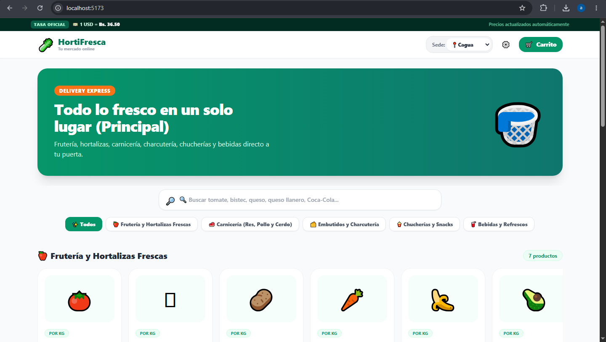
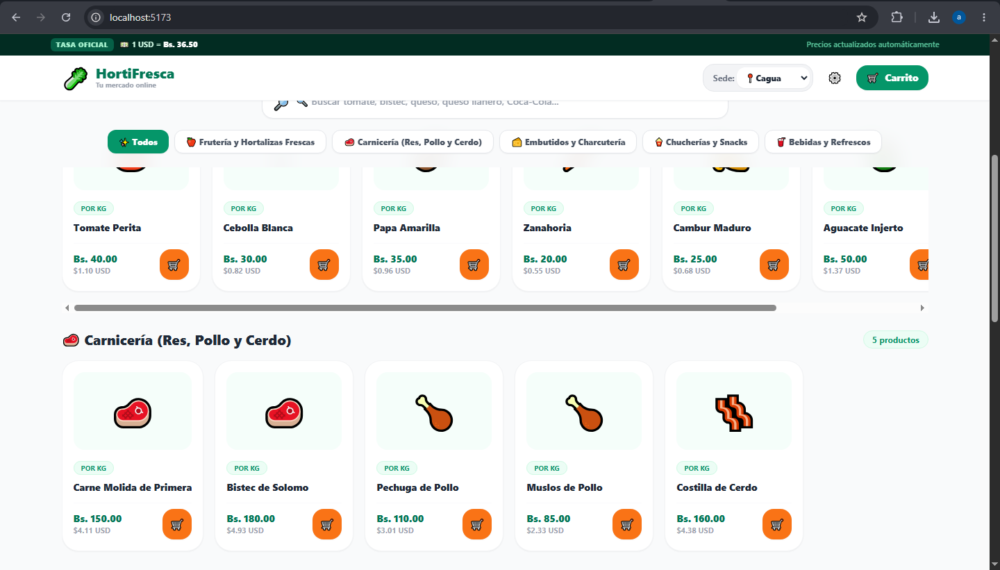
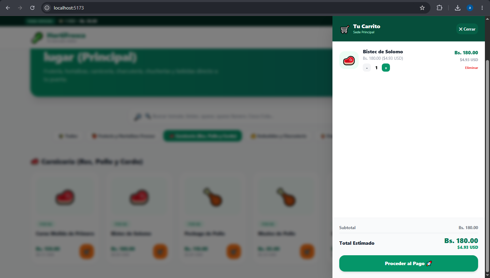
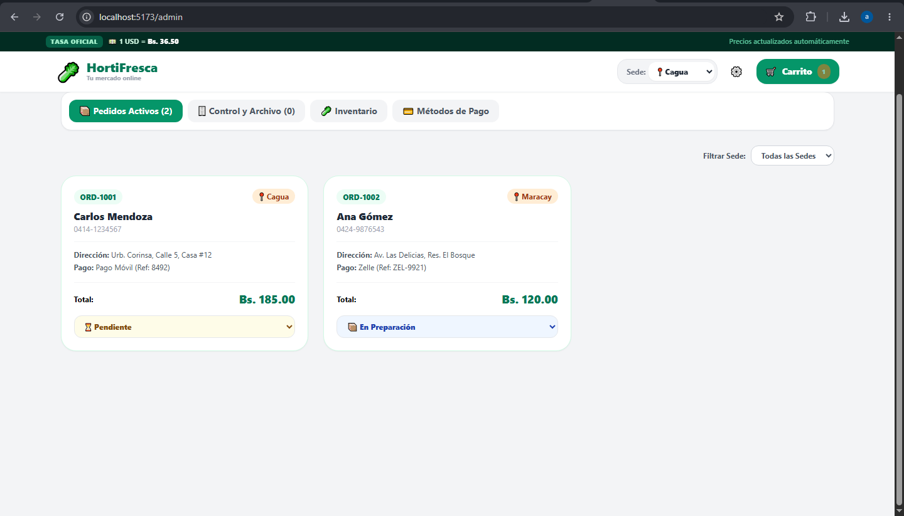

# Market — OrtiFresca

A personal e-commerce practice project built to develop and improve my frontend development skills with React and JavaScript.

## Overview

Market is a supermarket storefront concept where users can browse product categories, search for products, manage a shopping cart, and review order totals in Venezuelan bolívares and US dollars.

The project also includes an administrative dashboard concept for managing product inventory, orders, and payment-method information.

**Project status:** Personal learning project under development. Not a production-ready e-commerce platform.

## Features

* Product catalog with category filtering and search.
* Shopping cart with quantity controls.
* Checkout form and order summary.
* Currency conversion using a configurable example exchange rate.
* Administrative interface for inventory and order-state management.
* Responsive interface built with React and Tailwind CSS.

## Technology Stack

* React
* JavaScript
* Vite
* React Router
* Tailwind CSS
* Prisma schema drafted for PostgreSQL data modeling (database integration not yet verified)

## Getting Started

### Prerequisites

* Node.js and npm.

### Installation

1. Clone the repository:

   ```bash
   git clone https://github.com/AleHernandez16/Market.git
   ```

2. Enter the project directory:

   ```bash
   cd Market
   ```

3. Install dependencies:

   ```bash
   npm ci
   ```

4. Start the development server:

   ```bash
   npm run dev
   ```

5. Open the local URL shown in the terminal.

### Production Build

```bash
npm run build
```

## Current Limitations

* Backend and database integration need to be completed and verified.
* Order and inventory persistence across sessions has not been verified.
* Example contact, payment, and exchange-rate values must be replaced with safe demo configuration.
* Authentication, authorization, and production security have not been verified.
* Product imagery, real product pricing, and additional user features remain under development.

## What I Learned

This project has helped me practice React component composition, client-side routing, state management, product filtering, cart interactions, and designing an administrative interface.

## Author

Alejandro Hernandez

GitHub: https://github.com/AleHernandez16

This is an independent learning project and is not affiliated with a real supermarket or payment provider.


## Screenshots

### Home



### Product Catalog



### Shopping Cart



### Admin Dashboard


